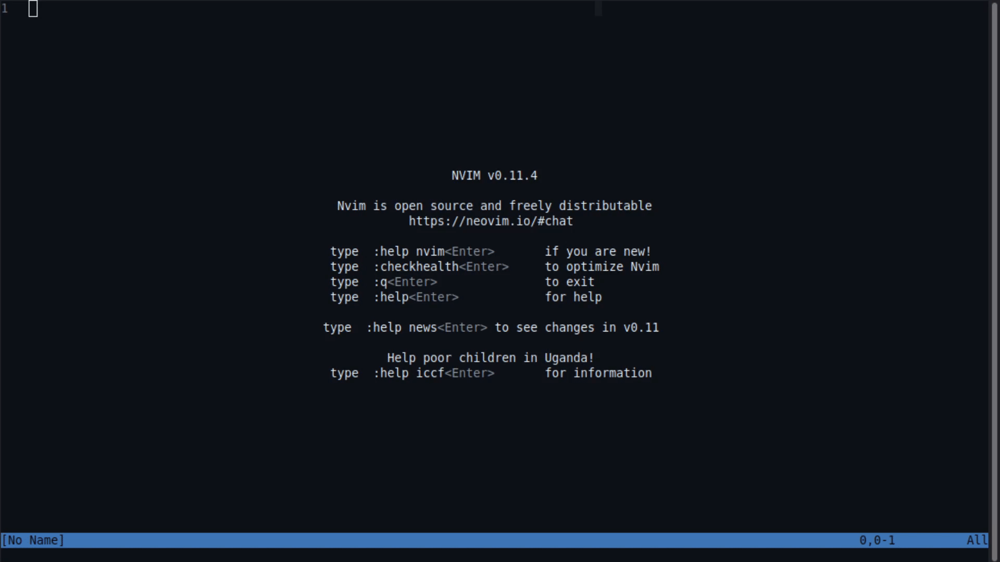

# gitstatus.nvim

A Neovim plugin for managing Git from the editor. Shows an interactive status window with support for staging, unstaging, and committing files.



## Installation

```lua
vim.pack.add({
  'https://codeberg.org/mauritz/gitstatus.nvim',
  -- optional dependencies
  'https://github.com/nvim-tree/nvim-web-devicons', -- display filetype icons
  -- 'https://github.com/nvim-mini/mini.icons' -- use mini.icons instead if you prefer
  -- 'https://github.com/rcarriga/nvim-notify', -- show fancy notifications
})
```

## Usage

Open the Git status window with `:Gitstatus`. For quick access, set up a mapping:

``` lua
vim.keymap.set('n', '<leader>s', vim.cmd.Gitstatus)
```

While inside the Git status window:
- `s` – Stage/unstage the file on the current line
- `a` – Stage all changes
- `c` – Open commit prompt
- `o` - Open file on the current line
- `q` – Close window
